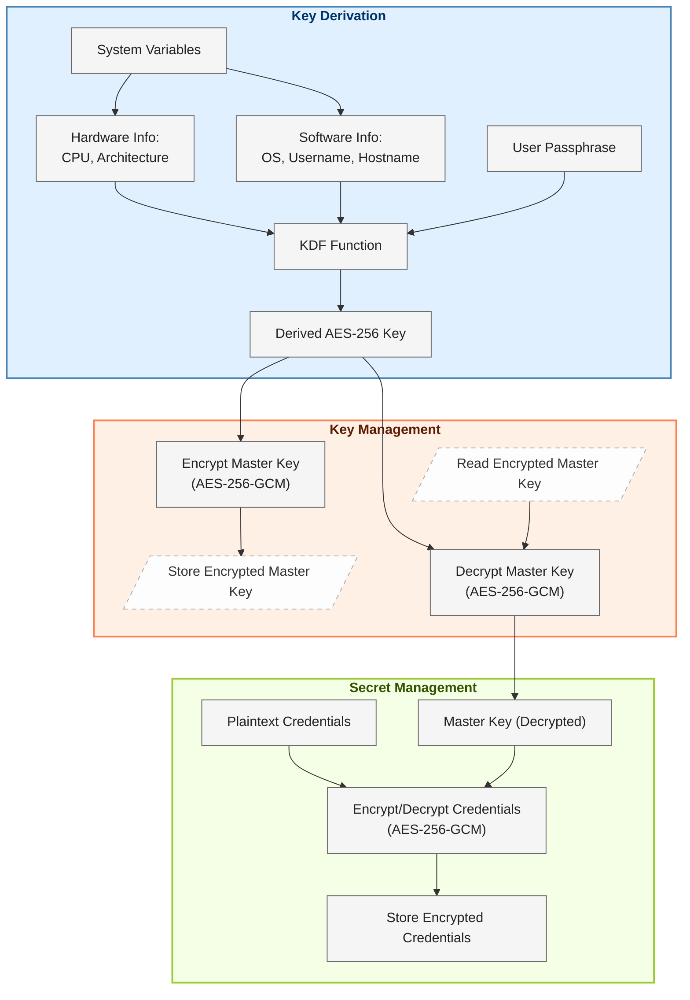

# SecureCredentials

SecureCredentials is a lightweight Python package designed to securely store key-value pairs, such as passwords 
or other sensitive information, on disk. By leveraging modern AES-GCM 256-bit encryption and a dual encryption scheme, 
the package ensures that your sensitive data and encryption keys remain safe, while still providing convenient access 
for everyday use.

## Why SecureCredentials Was Created
This package was created to address two common challenges faced by developers:

1. **Avoid storing sensitive credentials in plaintext:** It is unsafe for developers to store credentials such as 
database passwords, Active Directory passwords, and API keys in plaintext within their scripts or configuration files.
2. **Eliminate the need to repeatedly enter passwords:** Developers often have to enter their credentials every 
time they run a script, which can be cumbersome and error-prone. SecureCredentials allows for automatic retrieval 
of encrypted credentials, eliminating the need to type them each time.

## Key Features

- **Dual Encryption Scheme**: Your actual credentials are encrypted with a strong master key, and that master key is 
itself encrypted using a deterministic AES-GCM 256-bit key derived from your local system environment—ensuring 
multi-layered protection.
- **AES-256 Encryption (GCM mode)**: Uses modern AES-GCM encryption with a 256-bit key for both speed and strong 
cryptographic security.
- **Local Security**: All keys and encrypted data are stored locally, ensuring that no sensitive data leaves your system.
- **Convenience**: Automates secure access to stored credentials, removing the need to retype passwords or store 
them in plaintext.
- **Cross-Platform**: Works seamlessly across different operating systems, including Windows, Linux and macOS.

## Installation

To install SecureCredentials, run:

```bash
pip install securecredentials
```

## Usage

Below is a basic usage example:

```python
import securecredentials as sc

# Generate & store the unique master key - This needs to be done only once. 
master_key = sc.generate_master_key()
sc.store_master_key(master_key=master_key)

# Encrypt and store the key-value pair on the disk for later retrieval.
sc.set_secure(field='field_name', plaintext='my plaintext string')

# Retrieve the encrypted field as needed.
my_secure_string = sc.get_secure(field='field_name')
print(my_secure_string)
```

## How it works



## Dependencies

SecureCredentials requires the following Python libraries:

- **cryptography:** For encryption and decryption.


## Release Notes

For detailed version history, see the [CHANGELOG.md](https://github.com/rohitlal125555/securecredentials/blob/main/CHANGELOG.md) file.


## License

SecureCredentials is licensed under the Apache License Version 2.0. See the 
[LICENSE](https://github.com/rohitlal125555/securecredentials/blob/main/LICENSE) file for details.

## Contributing

Contributions are welcome! Feel free to open an issue or submit a pull request for improvements or feature requests.

## Support

If you encounter issues or have questions, please open an issue in the 
[GitHub repository](https://github.com/rohitlal125555/securecredentials/issues).

